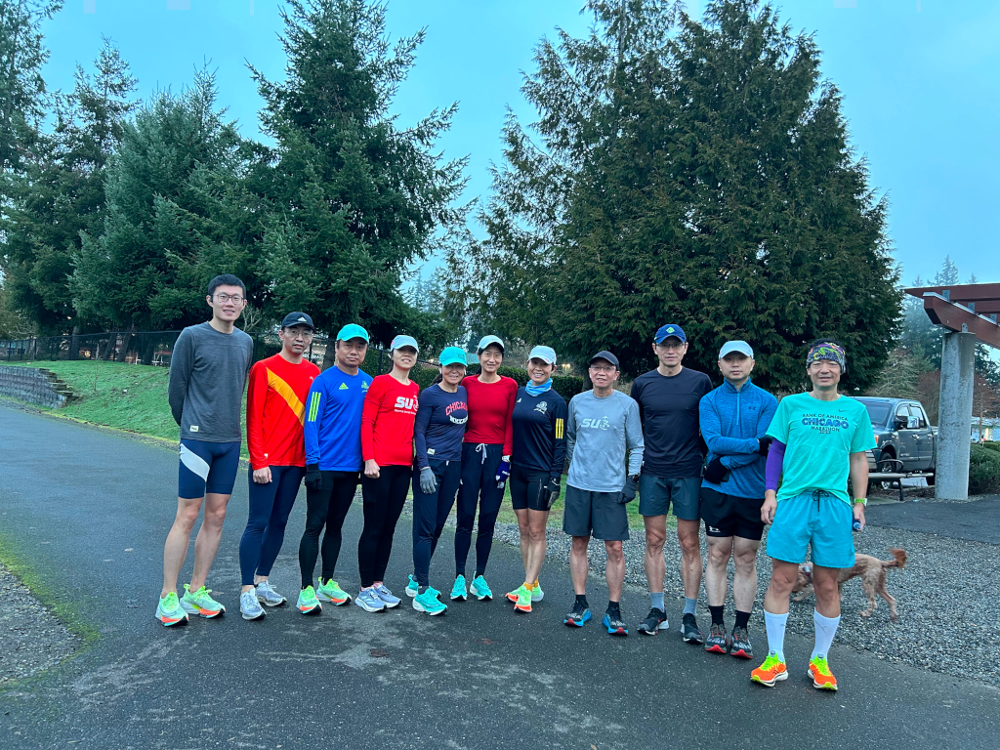
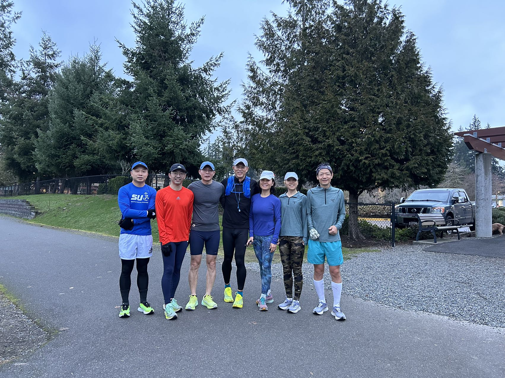
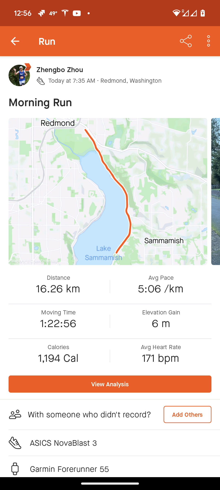
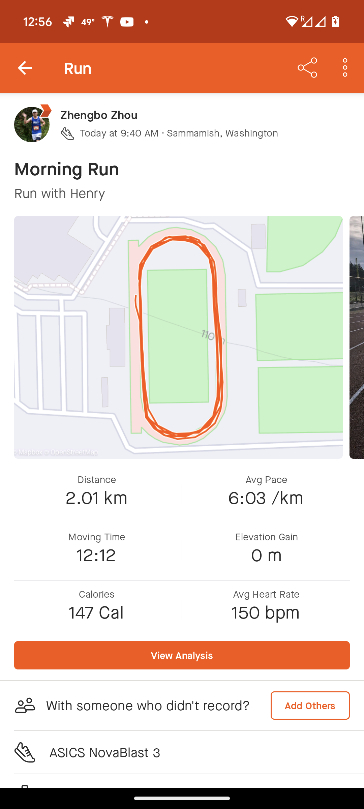
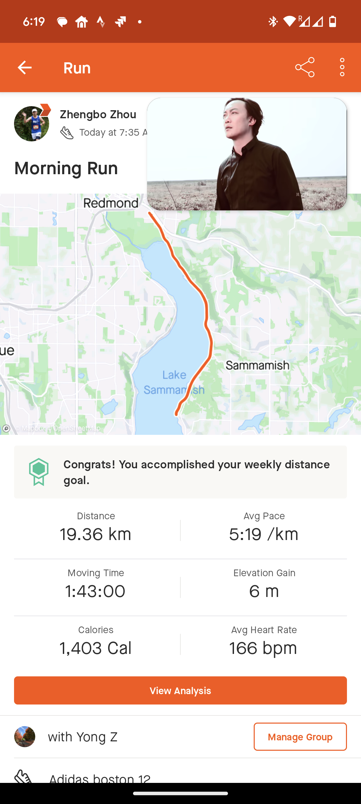

+++
title = '周末跑步'
date = 2024-02-04T23:45:49-08:00
tags = [
    "running",
]
description = "记录跑步情况"
author = "jumbo chow"
categories = ["running"]
+++

本周末连续两天跑了3场：
* 周六上午7点半跑了10迈，其中4迈跟着大腿们热身跑（其实我已经快mp了）。4迈以后大腿们开始进入加速训练计划，绝尘而去，剩我自己在浓雾中继续独自零乱并“缓慢前行”。不过后半程配速赶不上第四和第五迈的配速，一个人还是跑不起来阿。最后平均配速8分12,基本上算是满意吧。全程1小时22分多，虽然为了去接哥哥，也没有太消耗自己。跑完的体感还是不错的。

* 跑完群跑，赶紧赶回家接上哥哥去参加另外跑友提议的家庭（孩子）跑圈活动，在附近的eastlake high school。组织者还是很有心的一开始安排了孩子们热身，然后大家一起跑操场。我陪着哥哥跑，小伙子跑的还凑合，10分25秒第一迈的配速还是可以的。不过我事先和他说了最少跑一迈，他跑够一迈就不跑了。。。被我硬拉着又走了一圈（400米标准操场，4圈～=1迈）。下次应该说至少跑3迈，估计怎么也能跑到2迈半以上，恩，可以试试。不过就当作一迈是起点吧，希望以后能多参加运动。虽然之前跑了10迈，配速也不算低了，不过带着哥哥跑也没什么特殊的感觉。最后和哥哥走完，我还冲了一个5分迈的300+米，本来向冲一圈，后来是在坚持不了了。

* 周日上午7点半继续参加跑群活动，这次跟着大腿们跑12迈。前半程二姐和陶德就把我们甩开了，剩下诗人群主小花和我在后面望尘莫及。4迈以后，小花开始加速完成训练任务，剩下诗人群主和我。到5迈多，群主借口屁股疼，也折返了，剩下诗人和我继续。不过也从第五迈开始我们提速了。。。诗人保持了一贯的歪宁，一边说跑不快一边加速。今天基本上跑了个梯子，除了最后一迈有意放了一下作为cool down。最后平均配速8分34,如果最后一迈能坚持之前的配速，那可能更好一些。不过连续2天背靠背跑这样的配速，算是基本满意了，谁叫咱现在跑量不行阿。后半程和诗人一起刷步频，还是提不少速的，可惜需要上个厕所，否则最后一迈能快点。不过今天跑完体感还是能感觉疲劳的。

几个想法
1. 跑步还是需要经常跑的，一周最好4-5次，不用每次都很多，所以还是希望周中能抽出时间，跑个2-3次，每次4-6迈，配速9分左右既可。
2. 周末还是要跑2天，有大腿们带着还是能提高不少的。
3. 有机会还是要带着孩子长跑，每周跑1,2次就可以，小区里面跑个1-2迈，对孩子帮助应该也不小。

今天跑完，身体反应还是有一些，上午精神比较萎靡，下午稍微好一些，晚上开始感觉腿开始发酸了。看来连续跑长跑和相对高配速还是比较消耗能量呀。

上一些图片记录一下

